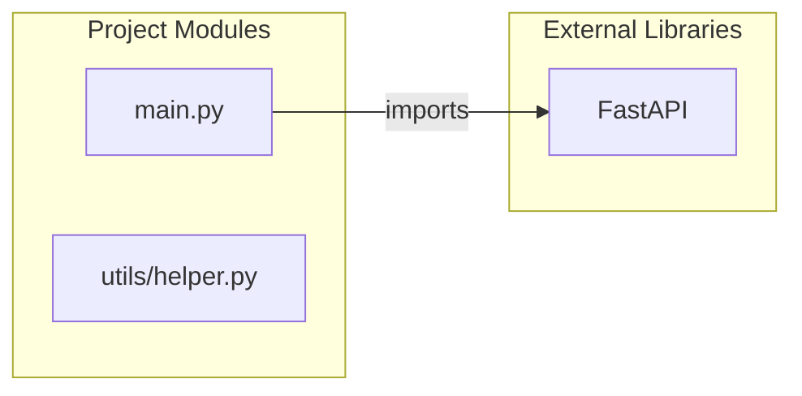

# Multi-Agent AI Documentation Report


# Technical Documentation

As a Senior Software Architect, I have thoroughly analyzed the provided codebase. While the current implementation is exceptionally minimal, it provides a foundational FastAPI application. This report will analyze the existing structure and propose a comprehensive architectural vision, anticipating future growth, scalability, and the potential complexities implied by the "AI Project" naming convention.

---

## 1. System Design

### High-Level Overview
The current system is a rudimentary, monolithic web service built using FastAPI. It exposes a single GET endpoint. All application logic resides within a single Python process, serving requests synchronously. There are no external dependencies such as databases, message queues, or external APIs.

### How Components Communicate
In the current setup, communication is entirely internal:
*   The FastAPI framework handles incoming HTTP requests and routes them to the appropriate endpoint handler function (e.g., `home`).
*   Python function calls (e.g., calling `home()`) represent the communication between the framework and the application logic.
*   There are no explicit inter-process or inter-service communication mechanisms in place. The `utils/helper.py` module contains a function, but it is currently not integrated into the main application's request handling flow.

### Request Flow
1.  A client (e.g., web browser, API consumer) sends an HTTP GET request to the root path (`/`) of the server.
2.  The FastAPI application receives the request.
3.  FastAPI's router dispatches the request to the `home` function defined in `main.py`.
4.  The `home` function executes, returning a Python dictionary `{"message": "Hello from sample project"}`.
5.  FastAPI serializes this dictionary into a JSON response.
6.  The JSON response is sent back to the client.

### Backend Architecture
The backend architecture is currently a **monolith**. Key characteristics:
*   **Single Process**: The entire application runs within a single Python process.
*   **In-Memory State**: Any state managed by the application would be in-memory, meaning it's not persistent across restarts and not shared across multiple instances.
*   **Synchronous by Default**: FastAPI supports asynchronous operations, but the current `home` function is defined as synchronous (`def home()`).
*   **Minimal Dependencies**: Only the FastAPI framework itself is a dependency.

**Scalability Improvements (General Principles for Backend Architecture):**
*   **Decoupling**: Separate concerns into distinct modules or services.
*   **Statelessness**: Design services to be stateless, pushing state management to external systems (databases, caches). This allows for easy horizontal scaling.
*   **Asynchronicity**: Utilize FastAPI's `async`/`await` capabilities for I/O-bound operations and integrate with message queues for long-running tasks.
*   **API-first Design**: Define clear API contracts using tools like OpenAPI (which FastAPI provides automatically).
*   **Observability**: Integrate logging, monitoring, and tracing from the outset.

---

## 2. Folder Structure

### Current Folder Structure
```
.
├── main.py
├── README.md
└── utils/
    └── helper.py
```
This structure is very basic, suitable only for the smallest of projects.

### Suggested Folder Structure
For an "AI Project" destined for growth, a more organized and scalable structure is essential. This proposal anticipates modules for API routes, business logic, data models, ML models, and configuration.

```
project_root/
├── .venv/                   # Python virtual environment
├── src/                     # Core application source code
│   ├── api/                 # API endpoint definitions (FastAPI routers)
│   │   ├── __init__.py
│   │   └── v1/
│   │       ├── __init__.py
│   │       └── home_router.py # e.g., for home endpoint
│   │       └── ai_router.py   # e.g., for AI specific endpoints
│   ├── core/                # Core business logic and services
│   │   ├── __init__.py
│   │   ├── services/        # Business logic for various domains
│   │   │   ├── __init__.py
│   │   │   └── ai_service.py
│   │   │   └── user_service.py
│   │   ├── schemas/         # Pydantic models for request/response validation
│   │   │   ├── __init__.py
│   │   │   └── ai_schema.py
│   │   │   └── user_schema.py
│   │   └── utils/           # General utilities (like helper.py)
│   │       ├── __init__.py
│   │       └── helper.py
│   ├── data/                # Data access layer (e.g., ORM models, database operations)
│   │   ├── __init__.py
│   │   └── database.py
│   │   └── models/          # SQLAlchemy/ORM models
│   │       ├── __init__.py
│   │       └── user_model.py
│   ├── ml/                  # Machine Learning specific components
│   │   ├── __init__.py
│   │   ├── models/          # Stored ML models (e.g., .pkl, .pt, .onnx)
│   │   │   └── sentiment_model.pkl
│   │   ├── preprocessing/   # Data preprocessing scripts/modules
│   │   └── inference/       # Inference logic for deploying models
│   │       └── predictor.py
│   ├── config.py            # Application configuration settings
│   ├── main.py              # Main FastAPI application entry point
│   └── dependencies.py      # Dependency injection handlers for FastAPI
├── tests/                   # Unit, integration, and end-to-end tests
│   ├── unit/
│   ├── integration/
│   └── e2e/
├── notebooks/               # Jupyter notebooks for experimentation and data analysis
├── scripts/                 # Helper scripts (e.g., database migrations, data loading)
├── docker-compose.yml       # Docker Compose for local development environment
├── Dockerfile               # Dockerfile for containerizing the application
├── requirements.txt         # Project dependencies
└── README.md                # Project documentation
```
**Explanation of Changes:**
*   **`src/`**: Encapsulates all source code for better organization.
*   **`api/`**: Separates API route definitions into their own modules, improving maintainability as the number of endpoints grows (e.g., `v1` for versioning).
*   **`core/services/`**: Contains the business logic, decoupled from the API layer.
*   **`core/schemas/`**: Holds Pydantic models for data validation and serialization, clearly defining API contracts.
*   **`data/`**: Manages database interactions and ORM models.
*   **`ml/`**: A crucial new section for an "AI Project," housing trained models, preprocessing, and inference logic.
*   **`config.py`**: Centralizes application settings.
*   **`main.py`**: Becomes a leaner entry point, primarily responsible for initializing FastAPI and registering routers.
*   **`dependencies.py`**: For FastAPI's dependency injection system (e.g., database sessions, authentication).
*   **`tests/`**: Dedicated directory for a robust testing suite.
*   **`docker-compose.yml`, `Dockerfile`, `requirements.txt`**: Standard files for modern Python development and deployment.

---

## 3. Component Relationships

### Current Component Relationships
The current codebase exhibits a very simple set of relationships:
*   `main.py` directly imports and uses the `FastAPI` class from the `fastapi` library.
*   `main.py` defines a single endpoint handler `home()`.
*   `utils/helper.py` contains a utility function `add()`, but it is **not currently imported or used** by `main.py` or any other part of the application. It stands as an independent module.

### Proposed Component Relationships (Based on Suggested Structure)
In a growing "AI Project," components would interact in a layered fashion to promote modularity and maintainability:

1.  **Client/API Gateway** communicates with **`src/main.py`**.
2.  **`src/main.py`** initializes the FastAPI application and registers routers from **`src/api/`**.
3.  **`src/api/v1/*.py`** (e.g., `ai_router.py`, `home_router.py`) defines specific API endpoints.
    *   These routers use Pydantic schemas from **`src/core/schemas/`** for request validation and response serialization.
    *   They invoke methods from **`src/core/services/`** to execute business logic.
4.  **`src/core/services/*.py`** (e.g., `ai_service.py`, `user_service.py`) contains the core business logic.
    *   It might interact with **`src/data/database.py`** or **`src/data/models/*.py`** for data persistence.
    *   For AI-specific tasks, it would call inference methods from **`src/ml/inference/predictor.py`**.
    *   It can use general utilities from **`src/core/utils/helper.py`**.
5.  **`src/ml/inference/predictor.py`** loads trained models from **`src/ml/models/`** and performs predictions. It might use preprocessing steps from **`src/ml/preprocessing/`**.
6.  **`src/data/database.py`** manages database connections and sessions.
7.  **`src/data/models/*.py`** defines ORM models, interacting with the database.
8.  **`src/config.py`** provides configuration to all relevant components (database connection strings, ML model paths, etc.).
9.  **`src/dependencies.py`** manages dependency injection (e.g., providing database sessions to services).

---

## 4. Scalability Suggestions

The current architecture is a single-instance monolith, which limits scalability. For an AI project, which can involve computationally intensive tasks, scalability is paramount.

1.  **Horizontal Scaling of FastAPI Application**:
    *   **Multiple Instances**: Run multiple instances of the FastAPI application.
    *   **Load Balancer**: Place a load balancer (e.g., Nginx, HAProxy, AWS ALB, GCP Load Balancer) in front of these instances to distribute incoming traffic.
    *   **Stateless Design**: Ensure the FastAPI application remains stateless (no in-memory user sessions) to allow any instance to handle any request. Externalize state to a database or cache.

2.  **Asynchronous Processing with Message Queues**:
    *   **Problem**: AI inference or data processing tasks can be long-running and block the main event loop.
    *   **Solution**: Use a message queue (e.g., **Redis/Celery**, RabbitMQ/Celery, Kafka) for background jobs.
        *   The FastAPI app quickly queues a task to the message broker.
        *   Worker processes (separate from the FastAPI app, potentially on different machines with GPUs) consume tasks from the queue and perform the heavy lifting.
        *   Workers can update results in a database or notify the client (via WebSockets or webhooks).

3.  **Caching**:
    *   **Problem**: Repeated expensive computations (e.g., AI inference for common queries) or frequent database lookups can be slow.
    *   **Solution**: Implement caching using an in-memory store like **Redis** or Memcached.
        *   Cache results of AI inferences, frequently accessed data, or precomputed aggregates.
        *   Implement cache invalidation strategies.

4.  **Database Scaling (when introduced)**:
    *   **Read Replicas**: For read-heavy applications, use database read replicas to distribute query load.
    *   **Sharding/Partitioning**: For very large datasets, partition the database across multiple servers.
    *   **Connection Pooling**: Efficiently manage database connections using libraries like `SQLAlchemy`'s connection pool.

5.  **Specialized Hardware for AI (GPU/TPU)**:
    *   **Dedicated Inference Services**: Isolate computationally intensive AI inference into dedicated services that can leverage GPUs or TPUs. These services would communicate with the main FastAPI application via internal APIs or message queues.
    *   **Docker & Kubernetes**: Use container orchestration to efficiently deploy and manage these specialized worker nodes, ensuring they have access to the necessary hardware.

6.  **CDN for Static Assets**:
    *   If the project serves any static files (e.g., large ML model files for download, UI assets), use a Content Delivery Network (CDN) to reduce latency and load on the origin server.

---

## 5. Deployment Suggestions

For production, the simplistic `uvicorn` command is insufficient. Robust deployment involves containerization, orchestration, and proper service management.

1.  **Containerization (Docker)**:
    *   **Dockerfile**: Create a `Dockerfile` to package the FastAPI application and its dependencies into a consistent, portable container image. This ensures environmental parity between development and production.
    *   **Benefits**: Reproducible builds, isolation, easier management of dependencies.

2.  **Container Orchestration**:
    *   **Kubernetes (K8s)**: The industry standard for managing containerized applications at scale.
        *   **Deployment**: Define `Deployment` resources to manage multiple replicas of the FastAPI application.
        *   **Service**: Use `Service` resources to expose the application within the cluster.
        *   **Ingress**: Use `Ingress` controllers (e.g., Nginx Ingress Controller) for external access, load balancing, and SSL termination.
        *   **Horizontal Pod Autoscaler (HPA)**: Automatically scale the number of application pods based on CPU utilization or custom metrics.
        *   **Persistent Volumes**: For any necessary persistent storage (e.g., ML model storage if not in S3).
    *   **Docker Swarm**: A simpler alternative to Kubernetes for smaller deployments.
    *   **AWS ECS / Google Cloud Run / Azure Container Apps**: Managed container services for easier setup and reduced operational overhead.

3.  **Platform-as-a-Service (PaaS)**:
    *   **Heroku, Google App Engine, AWS Fargate**: For developers who prefer not to manage underlying infrastructure. These platforms often handle scaling, load balancing, and deployment complexities automatically, simplifying operations.

4.  **Infrastructure-as-a-Service (IaaS) + Reverse Proxy**:
    *   **Cloud VMs (EC2, GCE, Azure VMs)**: Provision virtual machines.
    *   **Web Server/Reverse Proxy (Nginx/Caddy)**: Install Nginx or Caddy on the VM to act as a reverse proxy, handling:
        *   **SSL Termination**: Encrypting traffic (HTTPS).
        *   **Load Balancing**: Distributing requests to multiple `uvicorn` worker processes (managed by Gunicorn or Supervisor).
        *   **Static File Serving**: Serving static assets efficiently.
        *   **Request Filtering/Rate Limiting**.
    *   **Application Server (Gunicorn + Uvicorn workers)**: Use Gunicorn as a process manager to run multiple Uvicorn worker processes, maximizing CPU utilization.

5.  **Continuous Integration/Continuous Deployment (CI/CD)**:
    *   **Tools**: GitHub Actions, GitLab CI/CD, Jenkins, AWS CodePipeline/CodeBuild.
    *   **Workflow**:
        1.  Developers push code to a Git repository.
        2.  CI pipeline runs tests, linters, and builds the Docker image.
        3.  CD pipeline pushes the Docker image to a container registry (e.g., Docker Hub, ECR, GCR).
        4.  CD pipeline updates the Kubernetes deployment (or other deployment target) to pull the new image and roll out the update.

6.  **Monitoring and Logging**:
    *   Integrate comprehensive monitoring (Prometheus/Grafana) and centralized logging (ELK Stack, Loki, Datadog) from day one. This is crucial for debugging and understanding production behavior.

---

## 6. Microservices Possibilities

The current project is a single monolith. As the "AI Project" grows in features and complexity, a microservices architecture can offer benefits like independent deployability, technology diversity, and improved team autonomy.

Potential microservice splits, considering common AI project requirements:

1.  **API Gateway Service**:
    *   Acts as the single entry point for all client requests.
    *   Handles authentication, rate limiting, request routing to appropriate backend services.
    *   Could be a separate FastAPI app, Nginx, or a specialized gateway like Kong or AWS API Gateway.

2.  **Core AI Inference Service**:
    *   **Purpose**: Dedicated to running machine learning models for predictions.
    *   **Characteristics**: Highly optimized for AI inference (potentially using GPUs/TPUs), can be written in Python (TensorFlow, PyTorch, scikit-learn) or other languages/frameworks optimized for serving (e.g., Triton Inference Server).
    *   **Communication**: GPRC for high-performance internal communication, or REST API.
    *   **Scaling**: Scales independently based on inference load.

3.  **Data Ingestion & Preprocessing Service**:
    *   **Purpose**: Handles data acquisition from various sources, cleaning, transformation, and storage.
    *   **Characteristics**: Might involve streaming data processing (Kafka, Spark), batch jobs, or ETL pipelines.
    *   **Communication**: Messages via Kafka/RabbitMQ, or REST.

4.  **Model Management & Training Service**:
    *   **Purpose**: Manages the lifecycle of ML models (versioning, training orchestration, hyperparameter tuning).
    *   **Characteristics**: Could integrate with MLflow, Kubeflow, or other MLOps platforms. Triggers training jobs, potentially on separate compute clusters.
    *   **Communication**: Asynchronous job triggering via message queues.

5.  **User Management / Authentication Service**:
    *   **Purpose**: Handles user registration, login, profile management, and authorization.
    *   **Characteristics**: Standard CRUD operations for user data, integrates with OAuth2/OpenID Connect providers.
    *   **Communication**: REST API.

6.  **Notification Service**:
    *   **Purpose**: Sends emails, SMS, push notifications, or in-app alerts (e.g., "Your AI task is complete").
    *   **Communication**: Message queues.

7.  **Analytics / Telemetry Service**:
    *   **Purpose**: Collects usage data, performance metrics, and application logs for analytics and monitoring.
    *   **Communication**: Event streams (Kafka), log aggregation.

**Considerations for Microservices:**
*   **Increased Complexity**: Microservices introduce challenges in deployment, monitoring, distributed tracing, and data consistency.
*   **Communication Overhead**: Network calls replace in-process calls.
*   **Data Consistency**: Distributed transactions are complex; often, eventual consistency models are preferred.
*   **When to Split**: Only split when the complexity of a monolithic service becomes unmanageable, or when there are clear scaling and technology divergence needs. Start with a well-modularized monolith and extract services as needed (Strangler Fig Pattern).

---

## 7. Database Suggestions

The current project does not use a database. For an "AI Project," data storage is fundamental. The choice of database depends heavily on the specific types of data, access patterns, and consistency requirements.

1.  **Relational Databases (SQL)**:
    *   **Examples**: **PostgreSQL** (recommended as a versatile, robust, and feature-rich option), MySQL, SQLite (for local development/testing).
    *   **Use Cases**:
        *   Storing structured data: User profiles, application settings, transactional data.
        *   Tracking AI job metadata: Task status, model versions, training run parameters.
        *   Content management for prompts, responses, or structured data inputs/outputs for AI models.
    *   **Characteristics**: ACID compliance, strong consistency, well-defined schemas, powerful querying with SQL.

2.  **Document Databases (NoSQL)**:
    *   **Examples**: **MongoDB**, Couchbase, DynamoDB (AWS).
    *   **Use Cases**:
        *   Flexible schemas: Storing semi-structured data like user preferences, AI model configurations, logs, or outputs that might vary.
        *   Content storage: JSON-like documents can be good for storing rich text, chat histories, or complex AI response objects.
    *   **Characteristics**: Schema-less nature, easy horizontal scaling, good for large volumes of data, often optimized for read performance.

3.  **Key-Value Stores (NoSQL)**:
    *   **Examples**: **Redis** (highly recommended), Memcached, AWS ElastiCache.
    *   **Use Cases**:
        *   **Caching**: Crucial for storing frequently accessed data, session management, or results of expensive AI inferences.
        *   **Message Broker**: Can serve as a simple message queue for background tasks (e.g., with Celery).
        *   **Rate Limiting**: Efficiently track API request counts.
        *   **Real-time Leaderboards/Counters**.
    *   **Characteristics**: Extremely fast read/write, in-memory, can be persistent, often used as a cache or message broker.

4.  **Vector Databases (Specialized NoSQL)**:
    *   **Examples**: **Pinecone**, Milvus, Weaviate, Qdrant, Chroma, Faiss (library, not full DB).
    *   **Use Cases**: **Highly recommended for many advanced AI/ML applications.**
        *   Storing and querying high-dimensional vectors (embeddings) generated by ML models.
        *   Semantic search, similarity search, recommendation systems, retrieval-augmented generation (RAG) for LLMs.
        *   Finding "similar" items, images, or documents based on their learned representations.
    *   **Characteristics**: Optimized for vector similarity search (nearest neighbor search), high performance for specific AI workloads.

5.  **Object Storage**:
    *   **Examples**: **AWS S3**, Google Cloud Storage, Azure Blob Storage.
    *   **Use Cases**:
        *   Storing raw input data for training, large datasets.
        *   Storing trained ML model files (`.pkl`, `.pt`, `.onnx`, etc.).
        *   Backup and archival.
    *   **Characteristics**: Highly scalable, highly durable, cost-effective for large amounts of unstructured data.

**Recommendation**:
Start with **PostgreSQL** for core application data and **Redis** for caching and potential asynchronous task management. As AI features mature, evaluate the need for a **Vector Database** (e.g., Pinecone) to handle embedding storage and similarity search, and **AWS S3** for large-scale data and model file storage.

---

## 8. Observability Recommendations

Observability is crucial for understanding the behavior of a system in production, identifying issues, and optimizing performance. It encompasses logging, monitoring, and tracing.

1.  **Logging**:
    *   **Structured Logging**: Use `python-json-logger` or `loguru` to output logs in JSON format. This makes logs easily parsable and queryable by log aggregation systems.
    *   **Logging Levels**: Utilize standard logging levels (DEBUG, INFO, WARNING, ERROR, CRITICAL) appropriately.
    *   **Contextual Logging**: Include relevant request context (e.g., request ID, user ID) in logs to trace specific user journeys or requests.
    *   **Centralized Logging System**:
        *   **ELK Stack (Elasticsearch, Logstash, Kibana)**: A popular open-source solution for collecting, storing, and visualizing logs.
        *   **Grafana Loki**: Another open-source option, optimized for log aggregation and querying with Promtail.
        *   **Commercial Solutions**: Datadog, Splunk, New Relic Logs for comprehensive log management.

2.  **Monitoring**:
    *   **Metrics Collection**:
        *   **System Metrics**: CPU utilization, memory usage, disk I/O, network traffic (via Node Exporter or host agents).
        *   **Application Metrics**: Request per second, latency per endpoint, error rates, database query times, cache hit rates, AI model inference times, GPU utilization.
        *   **Custom Metrics**: Define specific metrics for key business logic or AI pipeline steps.
        *   **Tools**: **Prometheus** (for time-series data collection) with **Grafana** (for dashboarding and visualization). FastAPI applications can expose metrics via libraries like `prometheus_client`.
    *   **Alerting**: Set up alerts based on predefined thresholds for critical metrics (e.g., high error rates, low disk space, long inference times). Integrate with PagerDuty, Slack, or email for notifications.
    *   **Health Checks**: Implement `/health` and `/ready` endpoints in the FastAPI app for load balancers and orchestrators (Kubernetes) to check application status.

3.  **Tracing**:
    *   **Distributed Tracing**: As the system potentially evolves into microservices, distributed tracing becomes essential to track a request's journey across multiple services.
    *   **Tools**: **OpenTelemetry** (vendor-agnostic standard for instrumentation), **Jaeger**, **Zipkin**.
    *   **Benefits**: Visualize the full call stack of a request, identify bottlenecks, and debug issues in a distributed environment.

4.  **Error Tracking**:
    *   **Tools**: **Sentry**, Rollbar, Datadog APM.
    *   **Purpose**: Automatically capture and report application errors, providing stack traces, context, and impact analysis. This helps prioritize and fix bugs quickly.

---

## 9. Mermaid Diagrams

### 9.1. System Architecture Diagram

This diagram shows a typical production deployment for a FastAPI application, incorporating best practices like a load balancer, even for a single service.

```mermaid
graph TD
    A[Client Device] --> B(Internet / DNS)
    B --> C[Load Balancer]
    C --> D1[FastAPI Application Instance 1]
    C --> D2[FastAPI Application Instance 2]
    C --> D3[FastAPI Application Instance N]
    D1 --> E[Optional: Redis Cache]
    D2 --> E
    D3 --> E
    D1 --> F[Optional: PostgreSQL Database]
    D2 --> F
    D3 --> F
    D1 --> G[Optional: AI Inference Workers/GPU Cluster]
    D2 --> G
    D3 --> G
    subgraph Observability
        H[Centralized Logging: ELK/Loki]
        I[Monitoring: Prometheus/Grafana]
        J[Tracing: OpenTelemetry/Jaeger]
    end
    D1 -.-> H
    D1 -.-> I
    D1 -.-> J
    G -.-> H
    G -.-> I
    G -.-> J

    %% Explanations
    note on C
        Handles request distribution,
        SSL termination, health checks.
    end
    note on G
        For computationally intensive
        ML model serving, potentially
        on GPU-enabled machines.
    end
```

### 9.2. Application Flowchart (for the current `main.py` request)

This diagram illustrates the request flow for the current `/` endpoint.

```mermaid
graph TD
    A[Client HTTP GET /] --> B{FastAPI Application Server}
    B -- Request Routing --> C[main.py: home() function]
    C -- Returns --> D[{"message": "Hello from sample project"}]
    D -- Serializes to JSON --> E[HTTP 200 OK Response]
    E --> A
```

### 9.3. Dependency Graph

This diagram illustrates the current module dependencies within the provided codebase.



This project is a very minimal FastAPI application, primarily serving a single basic endpoint.

---

### 1. API Endpoints

*   `/`

### 2. Request Methods

*   `GET`

### 3. Request/Response Details

**Endpoint:** `/`

*   **Method:** `GET`
*   **Purpose:** Serves a simple "Hello" message. This could function as a basic health check or a root endpoint for a web UI.
*   **Request Details:**
    *   **Path Parameters:** None
    *   **Query Parameters:** None
    *   **Request Body:** None
    *   **Expected Headers:** Standard HTTP headers (e.g., `Accept`, `User-Agent`). No specific application-level headers are required.
*   **Response Details:**
    *   **Status Code:** `200 OK` (on success)
    *   **Content Type:** `application/json`
    *   **Response Body:**
        ```json
        {
            "message": "Hello from sample project"
        }
        ```
        *   `message`: `string` - A static greeting message.
    *   **Error Responses:** FastAPI's default error handling would apply (e.g., `404 Not Found` for other paths, `500 Internal Server Error` if the application crashed). No explicit custom error handling is defined.

---

### 4. Security Risks

Given the extremely limited functionality of the current project, the direct security risks are minimal, but potential issues arise if this were to scale without proper considerations.

1.  **Lack of Authentication/Authorization:** The `/` endpoint is entirely public and requires no form of authentication or authorization. While acceptable for a simple "hello world" or health check, any endpoint handling sensitive data or performing critical operations would require robust security mechanisms (e.g., API keys, OAuth2, JWT).
2.  **No Input Validation:** Currently, there's no user input, so this isn't a direct risk. However, if new endpoints were added that accept user input (e.g., for processing data with an AI model), a lack of validation could lead to:
    *   **Injection Attacks:** (SQL Injection, Command Injection) if interacting with databases or system commands without proper sanitization.
    *   **Malicious Data:** Passing malformed or unexpected data that could crash the application or lead to unintended behavior.
3.  **Denial of Service (DoS) Vulnerability (Potential):**
    *   **Resource Exhaustion:** If this simple endpoint were to become more complex (e.g., fetching data, performing calculations) and was hit by a large number of requests without rate limiting, it could lead to resource exhaustion and a denial of service.
    *   **No Rate Limiting:** There's no mechanism to limit the number of requests a single client can make over a period, leaving it open to basic DoS attacks if the underlying processing were to become expensive.
4.  **Information Disclosure:** The current endpoint discloses minimal information. However, verbose error messages in a production environment could inadvertently reveal internal system details (e.g., stack traces, database schemas) if not properly handled.
5.  **Lack of Logging and Monitoring:** Without proper logging of API requests, responses, and errors, it would be difficult to detect and respond to security incidents or unusual activity.

---

### 5. API Improvements

These improvements assume the project might grow beyond its current minimal state.

1.  **Authentication and Authorization:**
    *   **Implement for Protected Endpoints:** For any endpoints that interact with AI models, perform sensitive operations, or access user-specific data, introduce robust authentication (e.g., JWT, OAuth2) and authorization (role-based access control, scopes).
    *   **Example:** If an endpoint uses the `add` function from `utils/helper.py` to perform a calculation, you might want to ensure only authenticated users can access it.

2.  **Input Validation and Data Models:**
    *   **Use Pydantic:** Leverage FastAPI's integration with Pydantic for defining request and response models. This provides automatic data validation, serialization, and clear API documentation.
    *   **Example:** If an `add` endpoint were created:
        ```python
        from pydantic import BaseModel
        # ...
        class AddRequest(BaseModel):
            a: float
            b: float

        @app.post("/add")
        def perform_add(request: AddRequest):
            return {"result": add(request.a, request.b)}
        ```
    *   This ensures `a` and `b` are numbers and provides clear API contract.

3.  **Error Handling:**
    *   **Custom Exception Handlers:** Implement custom exception handlers for specific application errors (e.g., `ValueError` for invalid AI model inputs, `NotFoundException` for non-existent resources).
    *   **Standardized Error Responses:** Return consistent, machine-readable error responses (e.g., `{"detail": "Error message", "code": "APP_ERR_001"}`).
    *   **Prevent Information Leakage:** Ensure production error messages are generic and do not expose internal system details or stack traces.

4.  **Logging and Monitoring:**
    *   **Structured Logging:** Implement structured logging for API requests, responses, errors, and application events.
    *   **Monitoring:** Integrate with monitoring tools to track API performance, error rates, and resource utilization.

5.  **Rate Limiting:**
    *   **Implement Rate Limiting:** Add middleware or a library (e.g., `fastapi-limiter`) to limit the number of requests from clients, protecting against DoS attacks and abuse.

6.  **API Documentation and discoverability:**
    *   **OpenAPI/Swagger UI:** FastAPI automatically generates OpenAPI documentation and provides Swagger UI. Ensure docstrings and Pydantic models are used effectively to enrich this documentation.
    *   **Response Models:** Explicitly define `response_model` in decorator for better OpenAPI documentation clarity.

7.  **Refactor and Expand Functionality:**
    *   **Modularize Endpoints:** As the project grows, organize endpoints into separate routers (using `APIRouter`) to keep `main.py` clean and maintainable.
    *   **Implement AI Functionality:** If this is an "AI Project", integrate actual AI model inference endpoints. For example, an endpoint that takes an input and returns a prediction using an AI model.

8.  **Security Best Practices (General):**
    *   **HTTPS:** Always deploy APIs with HTTPS to encrypt data in transit.
    *   **CORS:** If the API is consumed by a web frontend, configure Cross-Origin Resource Sharing (CORS) appropriately to allow only trusted origins.
    *   **Dependency Security:** Regularly update project dependencies to patch known vulnerabilities.

By addressing these points, the project can evolve into a robust, secure, and maintainable API suitable for more complex AI applications.

This codebase is extremely minimal, consisting of a basic FastAPI "Hello World" application and a simple utility function. As such, many common security vulnerabilities are not present due to the lack of complex functionality, user input, or sensitive operations.

Below is an analysis based on the provided categories, highlighting what is present or absent, and then offering general recommendations for when the project scales.

---

### 1. Hardcoded Secrets

*   **Analysis**:
    *   The codebase does not contain any hardcoded API keys, passwords, database credentials, secret tokens, or other sensitive configuration information. Both `main.py` and `utils/helper.py` are free of such secrets.

*   **Conclusion**: No hardcoded secrets found.

---

### 2. Authentication Risks

*   **Analysis**:
    *   The `main.py` file defines a single public endpoint (`/`) that returns a simple "Hello World" message. This endpoint does not implement any form of authentication or authorization.
    *   For a simple informational endpoint like this, the absence of authentication is not inherently a security risk; it's designed to be publicly accessible.

*   **Conclusion**: No authentication is implemented. While not a risk for this specific "Hello World" endpoint, it would be a critical risk if the application were to handle sensitive data or operations without proper authentication.

---

### 3. API Security

*   **Analysis**:
    *   The API consists of a single GET endpoint (`/`).
    *   It does not process any user input (query parameters, request body).
    *   It returns a static, non-sensitive string message.
    *   There is no data exposure, insecure direct object references, broken access control, or other typical API security flaws simply because the API functionality is too limited to introduce them.

*   **Conclusion**: The API is too basic to exhibit complex security vulnerabilities. No specific API security issues were identified based on the current code.

---

### 4. Input Validation Problems

*   **Analysis**:
    *   **`main.py`**: The `/` endpoint does not accept any user input. Therefore, there's no opportunity for injection attacks (SQL, XSS, Command Injection, Path Traversal) or other input-related vulnerabilities.
    *   **`utils/helper.py`**: The `add(a, b)` function takes two arguments. In isolation, this function performs a simple arithmetic operation and doesn't inherently pose an input validation risk. However, if `a` or `b` were directly derived from unvalidated user input and then used in a sensitive context (e.g., constructing a file path or a database query *after* the addition), a vulnerability could arise. In the current codebase, this function is not used in such a sensitive manner.

*   **Conclusion**: No direct input validation problems were found as no user input is processed in a way that could lead to vulnerabilities.

---

### 5. Recommendations

Given the extreme simplicity of the codebase, these recommendations are proactive and designed to establish good security practices as the project evolves.

1.  **Configuration Management for Secrets:**
    *   **Recommendation**: As the project grows and requires API keys, database credentials, or other sensitive information, always store them in environment variables or a secure configuration management system (e.g., HashiCorp Vault, AWS Secrets Manager) rather than hardcoding them in the source code. Tools like `python-dotenv` can help manage local development environment variables.
    *   **Example (Conceptual)**:
        ```python
        # Instead of: API_KEY = "my_secret_key"
        import os
        API_KEY = os.getenv("MY_SERVICE_API_KEY")
        ```

2.  **Implement Authentication and Authorization (When Needed):**
    *   **Recommendation**: For any endpoints that access or modify sensitive data, or perform privileged operations, implement robust authentication (e.g., JWT, OAuth2, API keys) and fine-grained authorization (role-based access control). FastAPI provides excellent tools for this using `Depends`.
    *   **Example (Conceptual)**:
        ```python
        from fastapi import Depends, HTTPException, status
        from your_auth_module import verify_token

        @app.get("/protected-data")
        def protected_endpoint(user: dict = Depends(verify_token)):
            # Only accessible by authenticated users
            return {"data": f"Hello, {user['username']}, here's your sensitive data"}
        ```

3.  **Strict Input Validation and Sanitization:**
    *   **Recommendation**: For all future API endpoints that accept user input (query parameters, path parameters, request bodies), use FastAPI's Pydantic models for automatic data validation, type coercion, and error handling. For any string inputs that will be used in dynamic queries, file paths, or rendered HTML, explicitly sanitize them to prevent injection attacks (SQL injection, XSS, path traversal, command injection).
    *   **Example (Conceptual)**:
        ```python
        from pydantic import BaseModel

        class Item(BaseModel):
            name: str
            price: float = Field(..., gt=0) # Ensure price is greater than 0

        @app.post("/items/")
        def create_item(item: Item):
            # Input is automatically validated by Pydantic
            return item
        ```

4.  **Error Handling and Logging:**
    *   **Recommendation**: Implement centralized error handling to prevent sensitive information from being exposed in error messages (e.g., stack traces). Use a structured logging system to record application events, warnings, and errors, ensuring that logs are stored securely and reviewed regularly.
    *   **Example**: FastAPI's `HTTPException` should be used for explicit error responses.

5.  **Dependency Security:**
    *   **Recommendation**: Keep all project dependencies (FastAPI, Starlette, Uvicorn, etc.) updated to their latest stable versions to benefit from security patches and bug fixes. Regularly audit dependencies for known vulnerabilities using tools like `pip-audit` or `Snyk`.

6.  **Security Headers:**
    *   **Recommendation**: Implement appropriate security headers to protect against common web vulnerabilities like XSS, clickjacking, and insecure connections. FastAPI can leverage Starlette's `Middleware` to add headers such as `Content-Security-Policy`, `X-Content-Type-Options`, `X-Frame-Options`, and `Strict-Transport-Security`.
    *   **Example**:
        ```python
        from starlette.middleware.cors import CORSMiddleware
        from starlette.middleware.httpsredirect import HTTPSRedirectMiddleware
        from starlette.middleware.trustedhost import TrustedHostMiddleware

        app.add_middleware(HTTPSRedirectMiddleware) # Forces HTTPS
        app.add_middleware(
            CORSMiddleware,
            allow_origins=["*"], # Adjust this to your specific frontend domains
            allow_credentials=True,
            allow_methods=["*"],
            allow_headers=["*"],
        )
        app.add_middleware(
            TrustedHostMiddleware, allowed_hosts=["example.com", "*.example.com"]
        )
        ```

7.  **Rate Limiting:**
    *   **Recommendation**: For public-facing APIs, implement rate limiting to protect against brute-force attacks, denial-of-service (DoS) attempts, and API abuse. Libraries like `fastapi-limiter` can be integrated.

8.  **Secure Deployment:**
    *   **Recommendation**: Ensure the application is deployed behind a firewall, with minimal open ports. Use HTTPS for all communications. Configure the web server (e.g., Nginx, Apache) or cloud environment (e.g., AWS, GCP) securely.

By following these recommendations, even a simple project can lay a strong foundation for future security, preparing it for more complex features and potential threats.


# Product Management Documentation

As a Product Manager, here's an analysis and strategic plan for the "Sample AI Project" based on its current codebase:

---

## Product Specification: Sample AI Microservice Gateway

### 1. Business Overview

**Project Name:** AI Microservice Gateway (Code Name: "AI API Core")

**Problem:** Many organizations struggle with integrating and deploying AI models efficiently. Data scientists build models, but operationalizing them as scalable, accessible APIs often requires significant engineering effort, leading to slower time-to-market for AI-powered features.

**Solution:** The AI Microservice Gateway provides a lightweight, flexible FastAPI-based foundation for quickly exposing AI models as RESTful APIs. It aims to simplify the deployment of machine learning inferences, offering a standardized interface for developers to consume AI capabilities without deep knowledge of the underlying model infrastructure.

**Target Audience:**
*   **Developers:** Building applications that need AI features (e.g., sentiment analysis, image classification).
*   **Data Scientists:** Looking for a straightforward way to deploy their trained models as services.
*   **Product Managers:** Needing to quickly prototype and test AI-driven product features.

**Overall Goal:** To accelerate the integration of AI into applications by providing a simple, scalable, and developer-friendly API layer for AI models.

### 2. User Flow

Given the current minimal codebase, the immediate user flow is extremely basic. We will illustrate the current flow and then the envisioned future flow.

**Current (Developer as User):**

1.  **Developer sets up and runs the FastAPI server.** (e.g., `uvicorn main:app --reload`)
2.  **Developer opens a web browser or uses an API client** (e.g., Postman, `curl`).
3.  **Developer sends a GET request to the root endpoint:** `GET /`
4.  **The API responds with:** `{"message": "Hello from sample project"}`
5.  **Developer confirms the service is running.**

**Future (Envisioned - Developer as User integrating AI):**

1.  **Developer identifies a need for an AI capability** (e.g., "I need to classify customer feedback").
2.  **Developer consults the API documentation** (which will eventually describe available AI endpoints).
3.  **Developer prepares input data** according to the specified format for a particular AI endpoint (e.g., a text string for sentiment analysis).
4.  **Developer makes an API call to the relevant AI endpoint** (e.g., `POST /sentiment-analysis` with the text data).
5.  **The AI Microservice Gateway processes the request:**
    *   Receives the input data.
    *   Pre-processes the data (if necessary).
    *   Invokes the underlying AI model for inference.
    *   Post-processes the model's output (if necessary).
6.  **The API responds with the AI-generated result** (e.g., `{"sentiment": "positive", "score": 0.92}`).
7.  **Developer integrates this AI output into their application.**

### 3. Features

**Current Features (as per codebase):**

*   **Basic API Server:** A running FastAPI application.
*   **Root Endpoint (`/`):** Returns a static "Hello from sample project" message, serving as a basic health check or service availability indicator.
*   **Basic Utility Function (`add`):** A simple helper function that takes two numbers and returns their sum. Currently unused by the main API, but demonstrates utility module structure.

**Proposed Future Features (prioritized):**

**Phase 1 (MVP - Short-term):**
*   **AI Model Loading:** Ability to load a basic pre-trained AI model (e.g., a simple scikit-learn model, or a small Hugging Face transformer model) upon service startup.
*   **Inference Endpoint:** A dedicated `POST /predict` endpoint that accepts input data, passes it to the loaded AI model, and returns the model's output.
*   **Input Validation:** Basic validation for incoming request data to ensure it matches the model's expected input format.
*   **Error Handling:** Graceful handling and clear error messages for invalid inputs or model inference failures.

**Phase 2 (Growth - Medium-term):**
*   **Multiple Model Support:** Ability to serve multiple distinct AI models, each accessible via its own specific endpoint (e.g., `/sentiment`, `/image-classify`).
*   **Asynchronous Processing:** For potentially long-running inference tasks, implement asynchronous request handling to prevent blocking.
*   **API Authentication/Authorization:** Implement API keys or JWTs to secure access to AI endpoints.
*   **Logging and Monitoring:** Integrate structured logging for requests, responses, and errors. Add basic metrics for API usage and model performance.
*   **Documentation Generation:** Leverage FastAPI's automatic OpenAPI (Swagger UI) documentation.

**Phase 3 (Expansion - Long-term):**
*   **Model Versioning:** Support for deploying and rolling back different versions of the same AI model.
*   **Data Pre/Post-processing Pipelines:** Configurable steps for transforming raw input data before feeding it to the model, and formatting model output before sending it back.
*   **Custom Model Uploads:** A mechanism for data scientists to upload and deploy their own models through an API or UI.
*   **Scalability Features:** Integration with container orchestration (Docker, Kubernetes) and load balancing.

### 4. Business Value

Implementing and evolving the AI Microservice Gateway offers significant business value:

*   **Accelerated AI Adoption:** Dramatically reduces the friction for developers to integrate AI features into new or existing applications, speeding up time-to-market for AI-powered products.
*   **Cost Efficiency:** Lowers the operational overhead associated with deploying and managing individual AI models, potentially reducing infrastructure and engineering costs.
*   **Enhanced Developer Productivity:** Provides a clean, consistent API interface, freeing developers from needing to understand the complexities of individual AI models or frameworks.
*   **Scalability and Reliability:** Designed with a modern framework (FastAPI) suitable for building highly performant and scalable microservices, ensuring AI capabilities can meet growing demand.
*   **Modularity and Flexibility:** Allows for easy swapping, updating, or adding new AI models without disrupting dependent applications, fostering continuous innovation.
*   **Standardization:** Establishes a common way to expose AI services across the organization, improving governance and maintainability.

### 5. Risks

**Technical Risks:**

*   **Scalability Bottlenecks:** As more complex models or higher traffic volumes are introduced, the current simple setup might struggle with latency or throughput.
*   **Performance Degradation:** Slow model inference times can lead to poor user experience, requiring optimized model serving techniques (e.g., GPU acceleration, model quantization).
*   **Security Vulnerabilities:** Lack of authentication, authorization, or robust input sanitization could expose sensitive data or allow for abuse.
*   **Model Management Complexity:** As the number of deployed models grows, managing versions, dependencies, and lifecycle becomes challenging without dedicated tools.
*   **Dependency Hell:** Integrating various AI libraries with potentially conflicting dependencies can be difficult to manage.

**Business & Product Risks:**

*   **Limited Scope:** If the product doesn't quickly move beyond "Hello World" to offer real AI value, it will fail to gain adoption.
*   **Competition:** The market for AI deployment platforms and managed AI services is mature (e.g., AWS SageMaker, Google AI Platform, Azure ML). Differentiating this project is crucial.
*   **Lack of Clear Monetization Strategy:** Without a plan to generate revenue (if it's a commercial product), its long-term viability is questionable.
*   **Talent Gaps:** Ensuring the team has the necessary MLOps, backend, and security expertise to build out the proposed features.
*   **Model Drift/Obsolescence:** Deployed models can degrade in performance over time due to changes in real-world data, requiring robust monitoring and retraining pipelines (not currently in scope).

### 6. Future Improvements

**Short-Term (Next 1-3 Sprints):**

1.  **Integrate a Simple AI Model:** Load a basic, pre-trained AI model (e.g., a sentiment classifier, a spam detector, or a simple regression model) into `main.py` or a new module.
2.  **Create a `/predict` Endpoint:** Develop a `POST` endpoint that accepts relevant input (e.g., text for sentiment, numbers for regression), processes it with the loaded model, and returns a prediction.
3.  **Basic Input Validation:** Implement Pydantic models for incoming request bodies to ensure data integrity for the `/predict` endpoint.
4.  **Enhanced Logging:** Add basic structured logging (e.g., using `loguru` or `logging` module) to record requests, responses, and errors.
5.  **OpenAPI Documentation:** Leverage FastAPI's automatic Swagger UI to clearly document the new `/predict` endpoint.

**Medium-Term (Next 3-6 Months):**

1.  **Multi-Model Support:** Create a mechanism (e.g., configuration file, dynamic loading) to serve multiple AI models, each with its own endpoint and input/output specifications.
2.  **Authentication & Authorization:** Implement API key-based authentication for securing access to AI inference endpoints.
3.  **Dockerization:** Containerize the application using Docker to facilitate consistent deployment across environments.
4.  **Asynchronous Inference:** For models with longer inference times, explore using `asyncio` or background tasks to avoid blocking the main event loop.
5.  **Metrics & Monitoring Integration:** Add simple Prometheus metrics for API call counts, latency, and error rates.

**Long-Term (6+ Months):**

1.  **Model Versioning System:** Develop a robust system for deploying, managing, and rolling back different versions of AI models.
2.  **Scalable Deployment Strategy:** Design for deployment on Kubernetes or other container orchestration platforms, incorporating horizontal scaling.
3.  **Data Pre/Post-processing Pipelines:** Allow for configurable pre-processing of input data and post-processing of model outputs (e.g., normalization, tokenization, result formatting).
4.  **Model Management UI/API:** Create a separate administrative interface or API for managing deployed models (uploading new models, checking status, viewing logs).
5.  **Integration with MLOps Tools:** Explore integrations with popular MLOps platforms for full lifecycle management of models (e.g., MLflow, Kubeflow).

